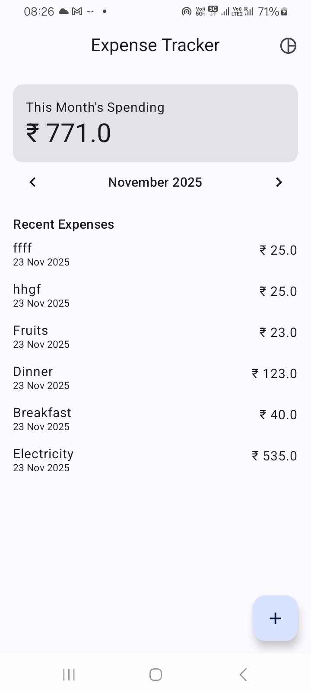
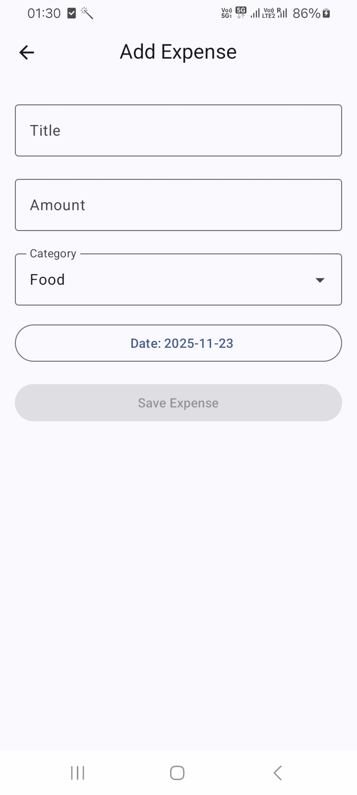
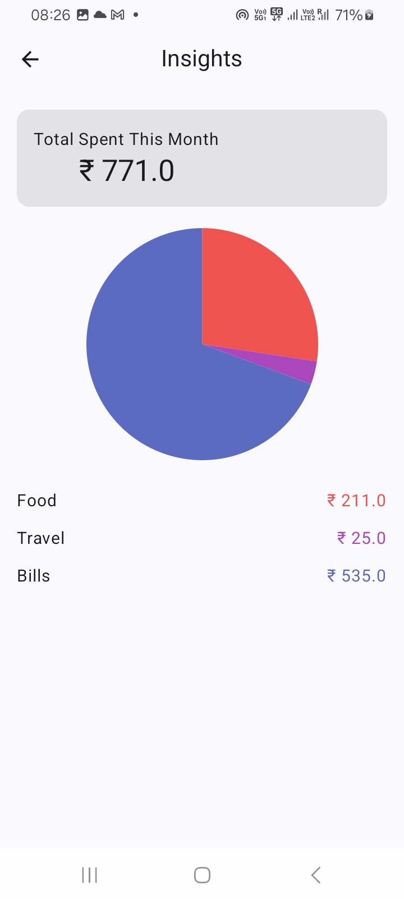

# 💰 Expense Tracker App

A modern **Expense Tracking** Android application built using **Clean Architecture**, **Jetpack Compose**, **Room**, **Hilt**, **Coroutines**, and **Flow**.  
This project is designed to be scalable, testable, and production-level — perfect for learning real-world Android development.

---

## 🚀 Features

- Add expense (In Local DB - Room)  
- Show list of expenses
- Insights with PieCharts  
- Delete Expense 
- Edit Expense
 

## 🧪 Tech Stack

- **Kotlin**
- **Jetpack Compose**
- **Coroutines**
- **StateFlow**
- **Room Database**
- **Hilt Dependency Injection**
- **Material 3**
- **MVVM Architecture**
- **Clean Architecture**
- **Navigation Compose**

## 📱 App Screens

  
  
  

