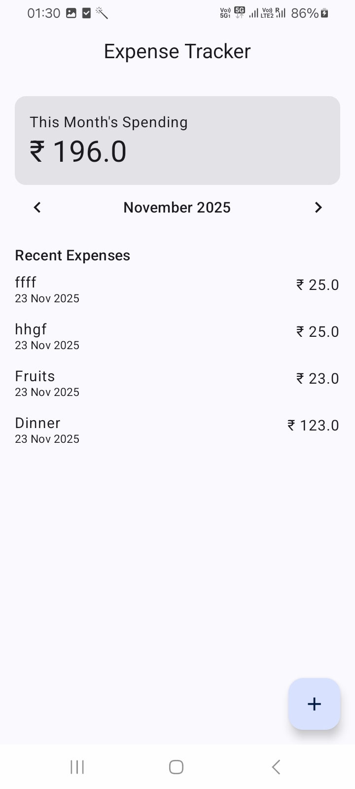

# 💰 Expense Tracker App

A modern **Expense Tracking** Android application built using **Clean Architecture**, **Jetpack Compose**, **Room**, **Hilt**, **Coroutines**, and **Flow**.  
This project is designed to be scalable, testable, and production-level — perfect for learning real-world Android development.

---

## 🚀 Features

- ➕ Add expense   
- 📅 Monthly filtering  
- 📊 Insights with Pie + Bar charts  
- 🔄 Real-time updates (Flow)  
- ⚡ Offline-first with Room  
- 🎨 Jetpack Compose UI  
- 🧱 Clean Architecture (MVVM + UseCases + Repository)  
- 🌙 Dark mode support  

## 🧪 Tech Stack

- **Kotlin**
- **Jetpack Compose**
- **Coroutines**
- **StateFlow**
- **Room Database**
- **Hilt Dependency Injection**
- **Material 3**
- **MVVM Architecture**
- **Clean Architecture**
- **Navigation Compose**

## 📱 App Screens
## 📸 Screenshots

  
  

